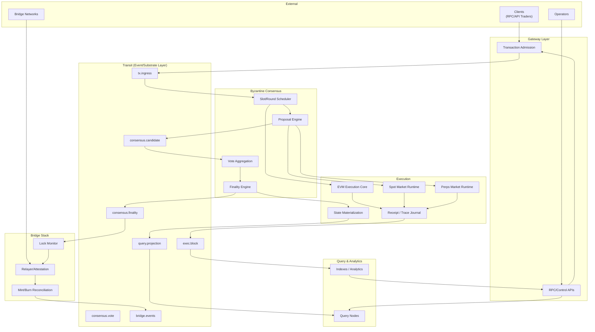
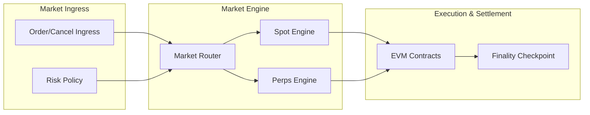
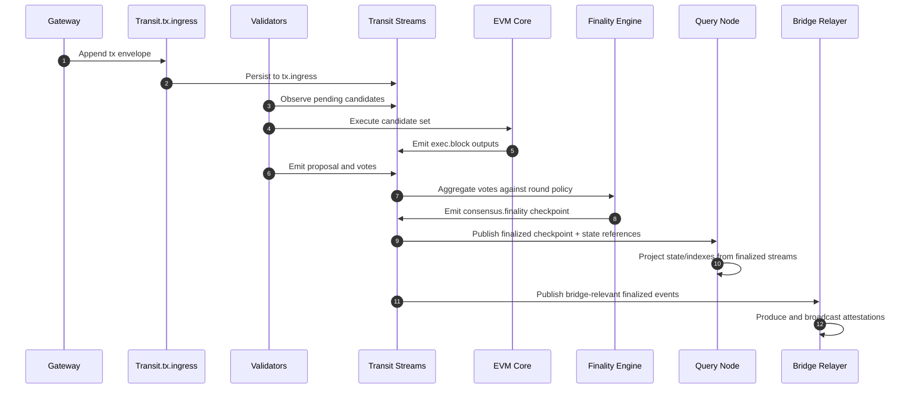
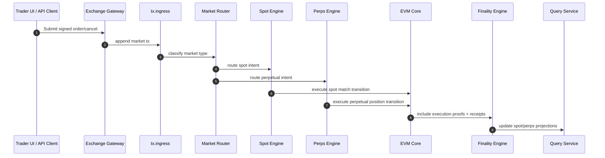
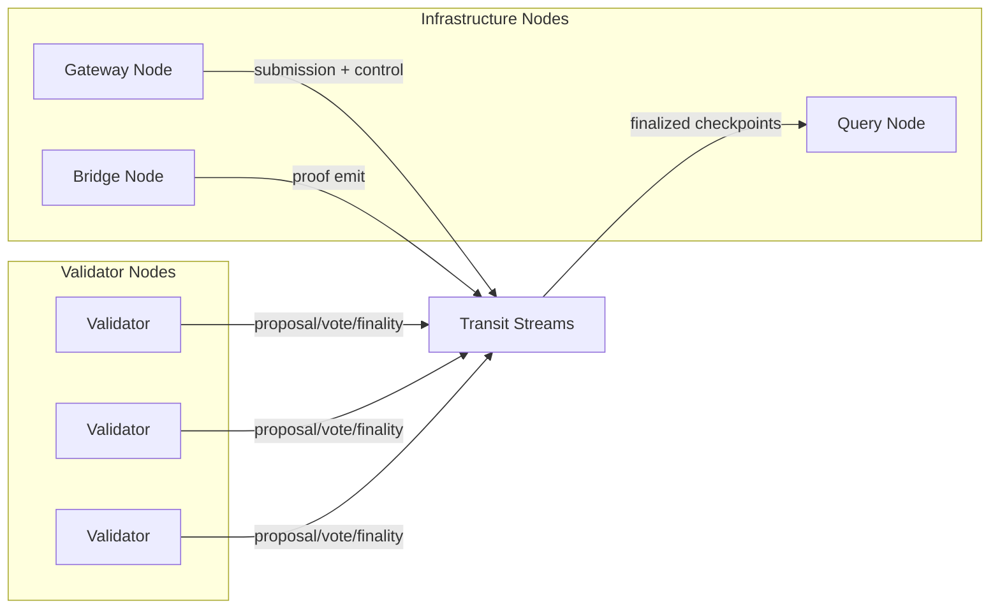

# Object Architecture

Object is a byzantine-safe EVM blockchain layer on Transit for a spot and perpetual exchange.
The design goal is to make node operation economically rational by splitting consensus-costly responsibilities from read and relay pathways while keeping finality, replay, and auditability explicit.

## Architecture at a Glance

## Design Rationale

- **Byzantine Layer owns consensus finality**: ordering and commitment are consensus outputs, not assumed from transport.
- **Transit owns durable sequencing and lineage**: proposals, votes, finality, and execution artifacts are immutable stream records with parent ancestry and stream policy.
- **Execution is deterministic but not authoritative**: execution outputs are committed only after byzantine finality signals are validated.
- **Query/data paths are separated from consensus paths**: read-optimized nodes can scale independently and recover from finalized checkpoints.
- **Bridges are consumer-of-finality**: cross-domain mint/burn actions use finalized evidence, not speculative lanes.

## Exchange Product Model

Object is purpose-built as an exchange infrastructure stack with two native market paths:

- **Spot markets**: order lifecycle, match commitment, and settlement accounting are finalized via byzantine finality and EVM state updates.
- **Perpetual markets**: perpetual position accounting, funding rate updates, and liquidation controls share the same finality substrate with stricter market invariants.

The intended execution model is "one finality fabric, two market types":

- Spot and perpetual order streams share the same ingress and candidate ordering path.
- Settlement and risk metadata are routed into market-specific modules at execution time.
- Both market types emit into the same projection layer so query nodes can serve unified account and trade state.

## Canonical Runtime Flow

## High Frequency Exchange Flow

## Primary Subsystems

### 1) Byzantine Consensus Subsystem
Responsibility: protocol safety and liveness for candidate ordering and commitment.

- Slot/round scheduling with deterministic proposer rotation.
- Proposal encoding, signed acknowledgements, and vote aggregation.
- Finality condition thresholds and fault-handling logic.
- Finality stream records as the single canonical commit signal.

### 2) Transit Stream Subsystem
Responsibility: immutable transport and lineage.

- Stream namespaces for each subsystem and pipeline stage.
- Stream policies that define admissible writers and expected provenance.
- Branching/reconciliation semantics for uncommitted candidate work.
- Recovery via checkpoint lineage and manifest verification.

### 3) Execution Subsystem
Responsibility: state transition correctness.

- Deterministic EVM execution from candidate payloads.
- Receipts, trie roots, and trace metadata.
- Checkpoint coupling for deterministic replay and fork closure.

### 4) Interface Subsystem
Responsibility: external accessibility and service stability.

- Transaction admission and mempool policy enforcement.
- Node control, health, and status APIs.
- Read-side serving and analytics through finalized projections.

### 5) Bridge Subsystem
Responsibility: secure interoperability.

- Observe finalized events and finality proofs from Transit.
- Validate transfer proofs against chain history.
- Publish bridge event and relay attestation streams.

## Transit Stream Taxonomy (Proposed)

All stream names are prefixed with `object.<chain>` and follow explicit suffix structure.

- `object.<chain>.tx.ingress`
- `object.<chain>.exchange.orders`
- `object.<chain>.exchange.cancellations`
- `object.<chain>.exchange.match.plan.<slot>`
- `object.<chain>.consensus.candidate.<slot>`
- `object.<chain>.consensus.vote.<slot>.<validator_id>`
- `object.<chain>.consensus.finality.<slot>`
- `object.<chain>.exec.block.<height>`
- `object.<chain>.state.snapshot.<kind>`
- `object.<chain>.spot.orderbook.<market>`
- `object.<chain>.spot.trade.<market>`
- `object.<chain>.perps.position.<market>`
- `object.<chain>.perps.funding.<market>`
- `object.<chain>.query.accounts`
- `object.<chain>.query.logs`
- `object.<chain>.bridge.events`
- `object.<chain>.bridge.attestations`

Every stream entry includes:

- chain/slot context
- previous stream references (lineage)
- actor identity and policy marker
- finality pointer when committed
- hash commitments for replay integrity

## Node Topologies

- Validators produce consensus-critical records and keep byzantine safety invariants.
- Gateways and query nodes are operationally separable from voting paths.
- Bridge nodes consume finalized outputs and emit attestation artifacts.

## Fault and Recovery Model

- Divergent candidates can exist transiently as branches in Transit.
- Canonical replay always starts from the latest byzantine-finalized checkpoint.
- Non-finalized branches are eventually garbage-collected once finality has moved forward and proofs are reconciled.
- Operator recovery uses checkpoint + checkpoint-manifest replay, then deterministic re-execution over replayed candidates.

## Native Bridge Fund Flow

Funds move in and out of Object through explicit bridge-native protocol actions:

- **Deposit / ingress**:
  - bridge module observes upstream lock or mint attestations,
  - emits finalized credit events in `object.<chain>.bridge.events`,
  - and credits execution state through finalized checkpoints.
- **Withdrawal / egress**:
  - users burn or escrow native claim objects on Object,
  - validators finalize burn events under byzantine finality,
  - relayers relay proofs to destination chains for release.

Native bridging is also the settlement path for cross-market liquidity transfers, which avoids introducing non-canonical transfer pathways outside consensus and Transit-recorded events.

## Current State

This repository is at the design and scaffolding stage for these components.

- Rust project and tooling layout are present.
- Core protocol modules are not fully implemented yet.
- The architecture and process documents are intended to remain the authoritative implementation target as those modules land.

## References

- Transit repository: https://github.com/spoke-sh/transit  
- Transit reference docs: https://www.spoke.sh/transit
