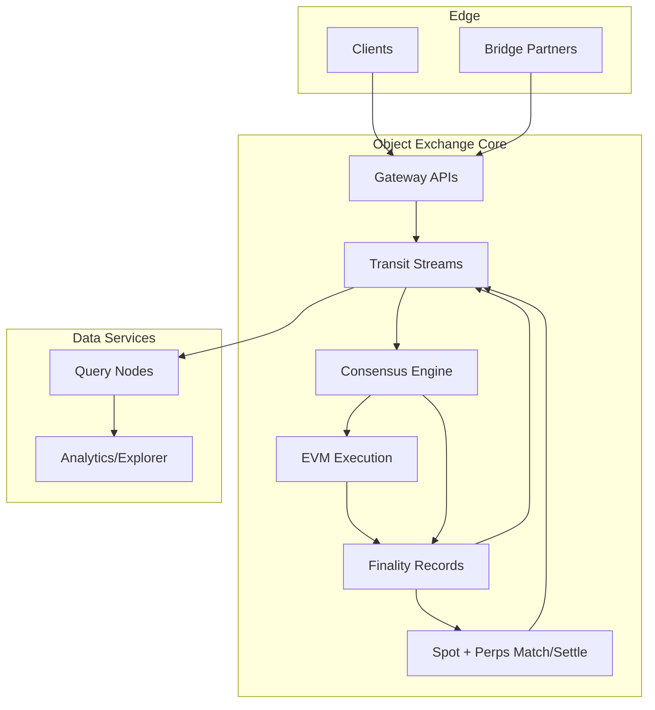

# Object

Object is a decentralized infrastructure stack for running an exchange-grade, operator-first EVM blockchain at a positive economics model for independent operators.

## System Overview

## Why this exists

Current decentralized networks put heavy operational cost on node operators, especially on ecosystems like Solana and Ethereum. Gas, state sync load, and complex node operations often make it economically irrational for independent operators to participate over the long term.

Object is designed around one main insight:

> Make node operation economically rational.

If running a node is costly but under-compensated, the network becomes less secure, less decentralized, and less resilient. Object aims to invert that dynamic by turning node operation into a viable business for operators.

## What is Object

Object is a project to build an interoperable exchange-oriented blockchain stack built on [Transit](https://github.com/spoke-sh/transit) and inspired by its design goals of fast settlement and operator-first execution.
The target chain runtime is an EVM chain built on top of Transit.

See [spoke.sh/transit](https://www.spoke.sh/transit) for the Transit reference design.

Object is not a generalized settlement layer; it is a purpose-built foundation for a
high-frequency exchange stack:

- **Spot market execution** with finalized order matching and settlement.
- **Perpetual market execution** with shared state and native risk flow.
- **EVM compatibility** for broad smart contract ecosystem access.
- **Native bridging** as the canonical value transfer path.
- **Fast transactions** through exchange-style execution and settlement paths.
- **Query nodes** optimized for read-heavy workloads, analytics, and API access.

## Core thesis

We are not trying to recreate a generalized L1 in isolation. We are building a unified, operator-first platform where infrastructure value is explicit:

- lower fixed cost to participate,
- higher reuse across execution, exchange, and data serving roles,
- clearer revenue pathways for operators.

## High-Frequency Exchange Focus

Object is designed for exchange workloads where order velocity is the critical path.

- high-volume order and cancel streams are isolated as first-class market inputs,
- consensus and execution follow a single deterministic slot/round path,
- query nodes consume finalized projections to keep read traffic off consensus participants.

## Goals

1. Reduce effective cost of node ownership through specialization and shared stack components.
2. Enable high-throughput trading and settlement patterns without sacrificing operator control.
3. Power both spot and perpetual markets on the same finality pipeline.
4. Keep the data plane queryable and useful through dedicated query node roles.
5. Provide practical interoperability through native bridge workflows.
6. Maintain a protocol design that encourages distributed participation.

## Exchange Design Notes

Object uses native bridges for movement of external assets in and out of the Object economy:

- **Deposit flow**: source chain lock or mint events are attested, then Object credits balances after finality validation.
- **Withdrawal flow**: users burn or lock object-native assets, bridge relayers relay proofs, and destination chains release assets.
- **Cross-market parity**: both spot and perpetual products consume the same transaction, execution, and finalization rails.
- **Operator economics**: high-frequency order handling is split between admission/matching roles and query/read roles to preserve predictable node operating cost.

## Repository structure

- `crates/object-server/`: Rust API server (Axum) with workspace-friendly Exchange API handlers.
- `crates/object-api/`: Shared Rust API/domain models used by server and downstream Rust services.
- `api/openapi/object-openapi.json`: OpenAPI contract for all Object APIs.
- `frontend/`: TanStack/React client that consumes the Object API specification.
- `flake.nix`: Nix development shell with Rust toolchain and project tooling.
- `justfile`: Common local commands for formatting, linting, and testing.

## Development status

Object is in early-stage development and is evolving quickly. The codebase currently provides

- the initial repository scaffolding,
- dev environment setup,
- and foundational workflow files.

## How to build

From the repository root:

- `nix develop`
- `just build` (workspace)
- `just build-server`
- `just build-frontend`

## Running tests

- `just test`
`just test` uses `cargo nextest` and is configured to treat an empty test set as a pass during early bootstrapping.

## Running the exchange stack

- `just run-server` starts the Rust API server at `http://localhost:3000`.
- `just run-frontend` starts the React app at `http://localhost:5173` and proxies `/api` to `http://localhost:3000`.
- `nix develop` provides Node.js 24 via the shell package set.

For a single-command local stack run `just dev` (server and frontend).

The OpenAPI document is consumed by the frontend through `/api/openapi.json` and the static
spec at `api/openapi/object-openapi.json`.

Generate frontend TypeScript API types from the OpenAPI contract with:

- `cd frontend && npm run gen:types`

## Contributing

Contributions are welcome. Keep changes scoped to the foundational direction of the project: making operator economics explicit and safe at chain scale.

## License

See [LICENSE](LICENSE).
